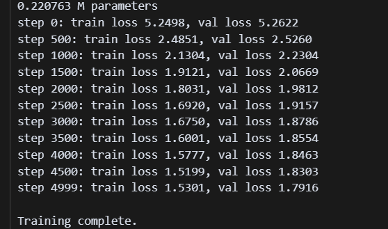
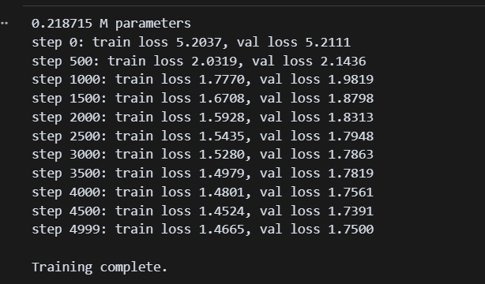
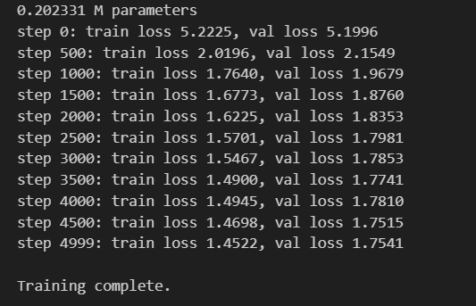

## hw2

Результаты работы: 

1. Провёл рефакторинг кода: Структура модели и обченную часть вынес отдельно в model.py и train.py. Вместо layerNorm теперь используется RMSNorm — ожидается, что это повысит эффективность и немного улучшит лосс. Эксперимент показал, что Loss действительно слегка снизился, но для этого датасета и выбранных гиперпараметров на эффективность почти не повлияло. (см. pic1)
   

2. Внедрил RoPE вместо обычного positional encodeing и доработал класс MultiHeadAttention (интегрировал туда прежний класс Head). Loss стал ниже по сравнению с предыдущим вариантом (см. pic2).

    
3. MultiHeadAttention был изменен на GQA(GroupQueryAttention). По сравнению с предыдущим механизмом MHA, наблюдается незначительное увеличение потерь. Это вполне закономерно, поскольку основная функция GQA заключается в повышении эффективности при обучении масштабных моделей и работе со сложными данными. При этом повышение эффективности достигается за счет уменьшения количества операций скалярного произведения между каждой парой запросов и ключей, что неизбежно приводит к некоторой потере выразительности модели.
   
   
